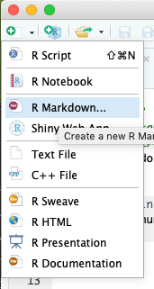
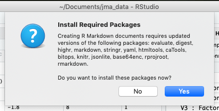
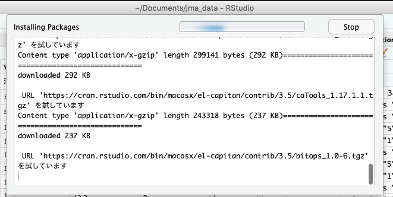
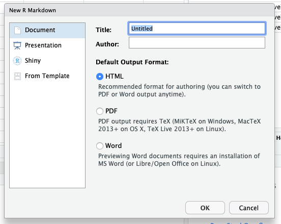

# 気象庁 過去データ処理

試しに，気象庁のサイトの過去データダウンロードから，月ごとのデータをダウンロード。

エディタで見ると（Shift-JIS なので注意）…

```
ダウンロードした時刻：2018/11/04 12:47:36

,酒田,酒田,酒田,酒田,酒田,酒田,酒田,酒田,酒田,酒田,酒田,酒田,酒田
年月,平均気温(℃),平均気温(℃),平均気温(℃),日最高気温の平均(℃),日最高気温の平均(℃),日最高気温の平均(℃),日最低気温の平均(℃),日最低気温の平均(℃),日最低気温の平均(℃),降水量の合計(mm),降水量の合計(mm),降水量の合計(mm),降水量の合計(mm)
,,品質情報,均質番号,,品質情報,均質番号,,品質情報,均質番号,,現象なし情報,品質情報,均質番号
1987/1,1.1,8,1,4.0,8,1,-1.8,8,1,140.5,0,8,1
1987/2,1.9,8,1,4.9,8,1,-0.9,8,1,115.0,0,8,1
```

1行目「ダウンロードした…」と2行目（空行），表形式にならないし不要。

3行目以降は

|  | 酒田 | 酒田 | 酒田 | 酒田 | 酒田 | 酒田 | 酒田 | 酒田 | 酒田 | 酒田 | 酒田 | 酒田 | 酒田 |
| ---- | ---- | ---- | ---- | ---- | ---- | ---- | ---- | ---- | ---- | ---- | ---- | ---- | ---- |
| 年月 | 平均気温(℃) | 平均気温(℃) | 平均気温(℃) | 日最高気温の平均(℃) | 日最高気温の平均(℃) | 日最高気温の平均(℃) | 日最低気温の平均(℃) | 日最低気温の平均(℃) | 日最低気温の平均(℃) | 降水量の合計(mm) | 降水量の合計(mm) | 降水量の合計(mm) | 降水量の合計(mm) |
|  |  | 品質情報 | 均質番号 |  | 品質情報 | 均質番号 |  | 品質情報 | 均質番号 |  | 現象なし情報 | 品質情報 | 均質番号 |
| 1987/1 | 1.1 | 8 | 1 | 4.0 | 8 | 1 | -1.8 | 8 | 1 | 140.5 | 0 | 8 | 1 |
| 1987/2 | 1.9 | 8 | 1 | 4.9 | 8 | 1 | -0.9 | 8 | 1 | 115.0 | 0 | 8 | 1 |


結構フォーマットがややこしいので，まずフォーマット整える。

## rubyで下ごしらえ

```ruby
#!//usr/bin/ruby
require 'csv'
inputFile = ARGV.shift
ouputFile = ARGV.shift

dataTable = CSV.read( inputFile, {
	headers:	false,
	encoding:	"Shift_JIS:UTF-8",
	return_headers:	false,
	skip_blanks: true,
	skip_lines: /^ダウンロードした時刻：.+/
} )

CSV.open(ouputFile,"wb") do |outputCSV|
	dataTable.each do |eachRow|
		outputCSV << eachRow
	end #each
end #
```
最初2行飛ばして，そのまま書き出しただけ。

考え直して，R でできるところまでやる。

R Markdown 導入。
R Studio で，

 


 

タイトルなど設定。


f <- read.table('~/Downloads/data-9.csv',sep=",", skip=1, header=F, fileEncoding = "Shift_JIS")
