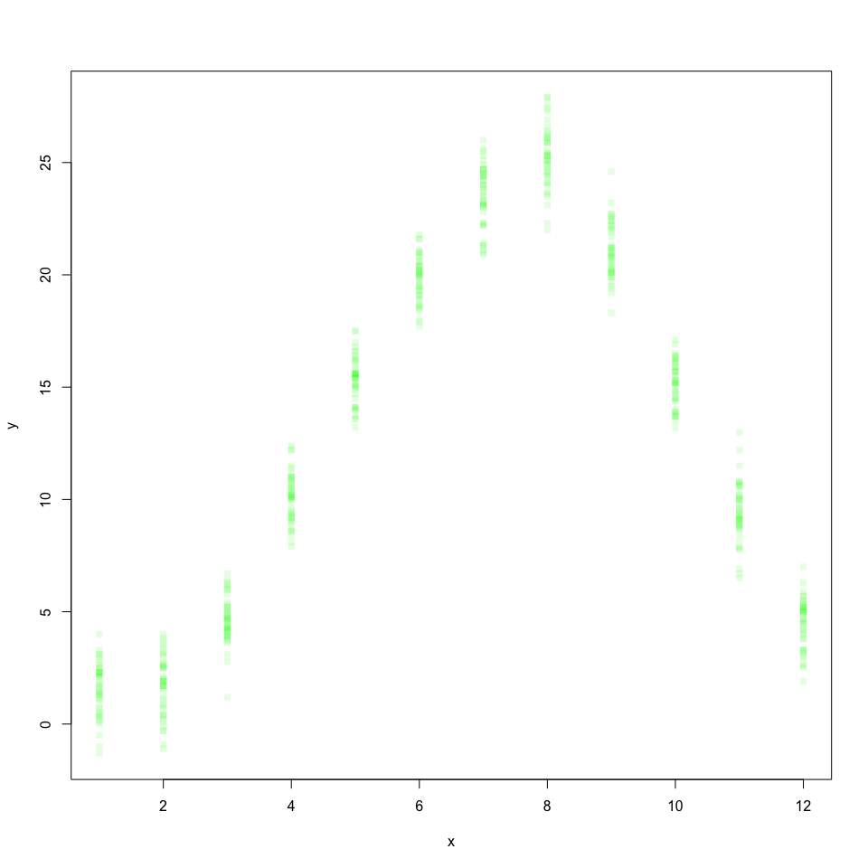
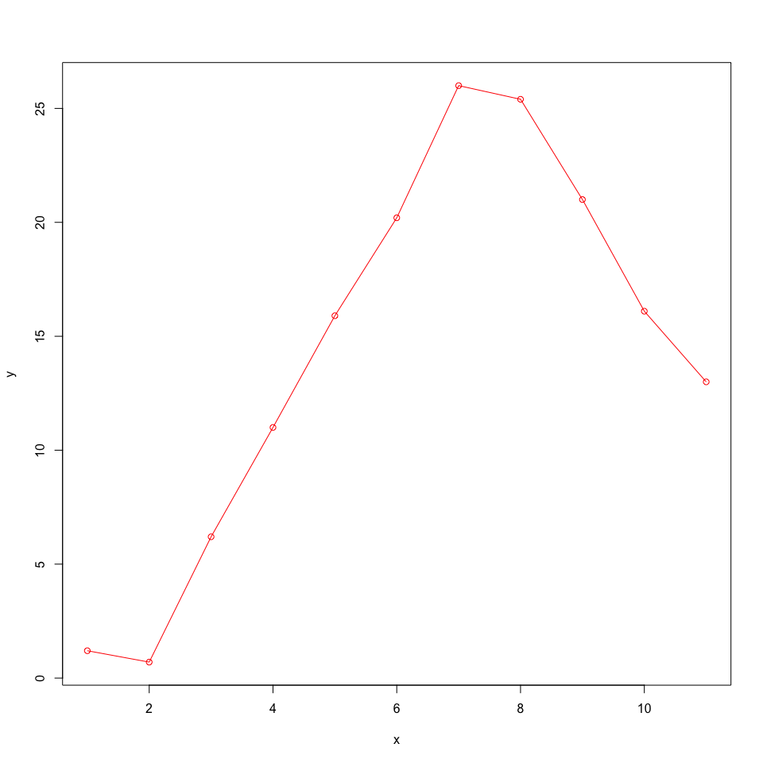
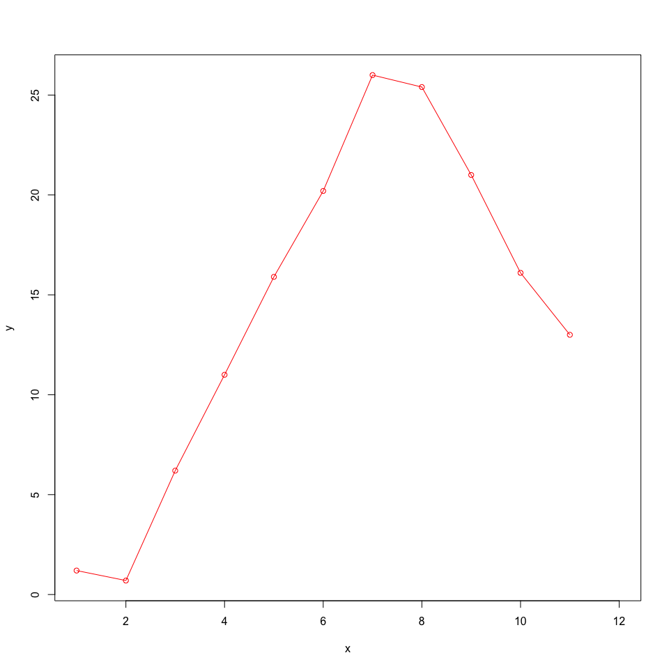
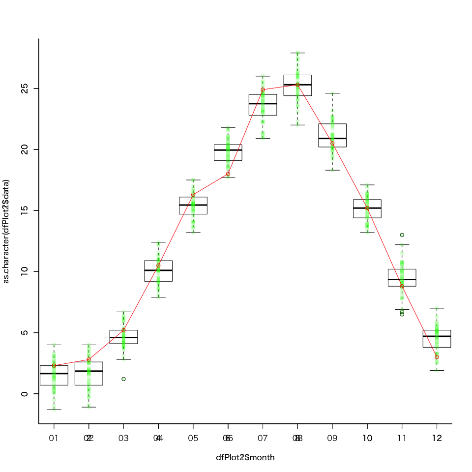
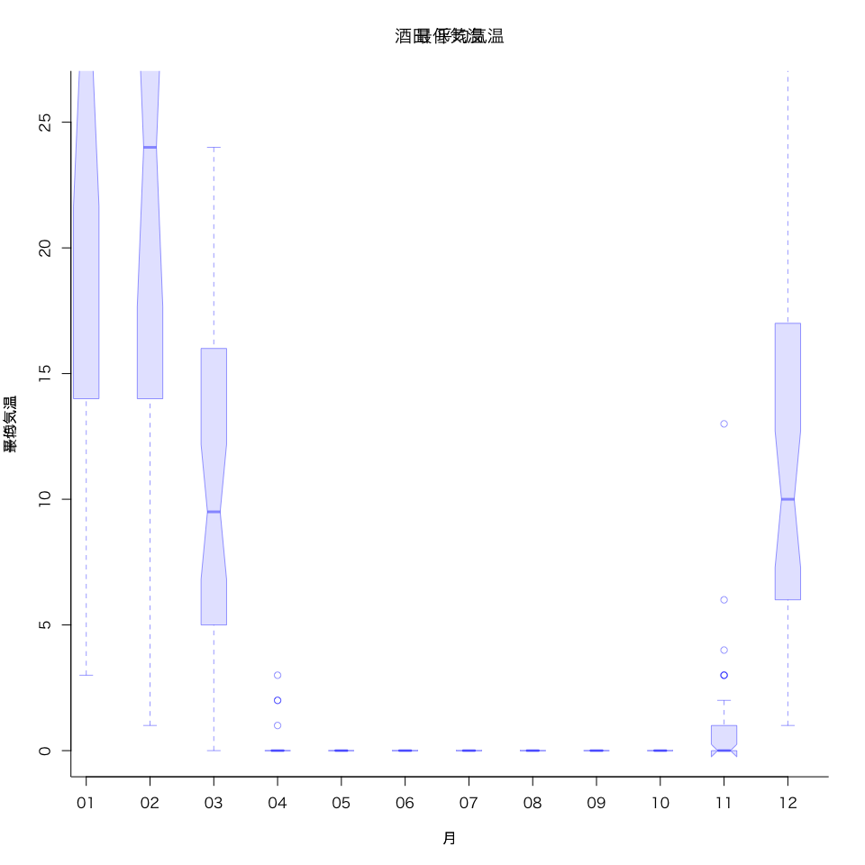

今までは，地点ごとに1つのデータフレーム だった。

これを，項目ごとに分けてみる。

とりあえず読み込んで

```r
# データ読み込み ファイル名指定
f <-
  read.table(
    'data.csv',
    sep = ",",
    skip = 1,
    header = F,
    fileEncoding = "Shift_JIS",
    stringsAsFactors = F,
# 空白を削除する
    na.strings=c("", "NULL")
)

# # 空行削除
is_blank <- function(x){
  is.na(x) | x == ""
}
# すべてが空欄である行を探す
unnecessary_row <- apply(f, 1, function(x){
  all(is_blank(x))
})
# 「すべてが空欄である行」以外を残す（＝空行の除去）
f <- f[!unnecessary_row,]


# str(f)
#各地点の地名
placeWithNull <- unique(as.vector(as.matrix(f[1,])[1,]))
placeList <- placeWithNull[!is.na(placeWithNull)]
```

```
V1: [NA], ["年月"], [NA], [年月], [年月], [年月]…
V2: [地名], [項目名+], [NA / 品質・均質 etc.], 
```
これを，
```
地点 => {
  項目名 => 
    date: 年月, 年月,…
    data: データ, データ,…
    qlty: データ, データ,…
    unfm: データ, データ,…
    exst: データ, データ,…
  }
  項目名 => 
    date: 年月, 年月,…
    data: データ, データ,…
    qlty: データ, データ,…
    unfm: データ, データ,…
    exst: データ, データ,…
  }
}
```

とまとめたい。


```r
dfList <- list()
for(i in placeList){
  # 先頭列は日付
  yearMonthDf <- f[,1]
  placeDf <- f[,which(f[1,] == i)]
  itemWithNull <- unique(as.vector(as.matrix(f[2,])[1,]))
  placeDfList <- list()
  for(j in itemWithNull){
    thisItemDf <- placeDf[,which(placeDf[2,] == j)]
    placeDfList[[j]] <- thisItemDf
  }
  dfList[[i]] <- placeDfList
}
str(dfList)
```

```
## List of 2
##  $ 酒田:List of 8
##   ..$ 年月                :'data.frame':	506 obs. of  0 variables
##   ..$ 平均気温(℃)        :'data.frame':	506 obs. of  3 variables:
##   .. ..$ V2: chr [1:506] "酒田" "平均気温(℃)" NA "-1.3" ...
##   .. ..$ V3: chr [1:506] "酒田" "平均気温(℃)" "品質情報" "8" ...
##   .. ..$ V4: chr [1:506] "酒田" "平均気温(℃)" "均質番号" "1" ...
##   ..$ 日最高気温の平均(℃):'data.frame':	506 obs. of  3 variables:
##   .. ..$ V5: chr [1:506] "酒田" "日最高気温の平均(℃)" NA "1.0" ...
##   .. ..$ V6: chr [1:506] "酒田" "日最高気温の平均(℃)" "品質情報" "8" ...
##   .. ..$ V7: chr [1:506] "酒田" "日最高気温の平均(℃)" "均質番号" "1" ...
##   ..$ 日最低気温の平均(℃):'data.frame':	506 obs. of  3 variables:
##   .. ..$ V8 : chr [1:506] "酒田" "日最低気温の平均(℃)" NA "-4.4" ...
##   .. ..$ V9 : chr [1:506] "酒田" "日最低気温の平均(℃)" "品質情報" "8" ...
##   .. ..$ V10: chr [1:506] "酒田" "日最低気温の平均(℃)" "均質番号" "1" ...
##   ..$ 降水量の合計(mm)    :'data.frame':	506 obs. of  4 variables:
##   .. ..$ V11: chr [1:506] "酒田" "降水量の合計(mm)" NA "101.0" ...
##   .. ..$ V12: chr [1:506] "酒田" "降水量の合計(mm)" "現象なし情報" "0" ...
##   .. ..$ V13: chr [1:506] "酒田" "降水量の合計(mm)" "品質情報" "8" ...
##   .. ..$ V14: chr [1:506] "酒田" "降水量の合計(mm)" "均質番号" "1" ...
##   ..$ 日降水量の最大(mm)  :'data.frame':	506 obs. of  4 variables:
##   .. ..$ V15: chr [1:506] "酒田" "日降水量の最大(mm)" NA "17.5" ...
##   .. ..$ V16: chr [1:506] "酒田" "日降水量の最大(mm)" "現象なし情報" "0" ...
##   .. ..$ V17: chr [1:506] "酒田" "日降水量の最大(mm)" "品質情報" "8" ...
##   .. ..$ V18: chr [1:506] "酒田" "日降水量の最大(mm)" "均質番号" "1" ...
##   ..$ 日照時間(時間)      :'data.frame':	506 obs. of  4 variables:
##   .. ..$ V19: chr [1:506] "酒田" "日照時間(時間)" NA "68.9" ...
##   .. ..$ V20: chr [1:506] "酒田" "日照時間(時間)" "現象なし情報" "0" ...
##   .. ..$ V21: chr [1:506] "酒田" "日照時間(時間)" "品質情報" "8" ...
##   .. ..$ V22: chr [1:506] "酒田" "日照時間(時間)" "均質番号" "1" ...
##   ..$ 最深積雪(cm)        :'data.frame':	506 obs. of  4 variables:
##   .. ..$ V23: chr [1:506] "酒田" "最深積雪(cm)" NA "31" ...
##   .. ..$ V24: chr [1:506] "酒田" "最深積雪(cm)" "現象なし情報" "0" ...
##   .. ..$ V25: chr [1:506] "酒田" "最深積雪(cm)" "品質情報" "8" ...
##   .. ..$ V26: chr [1:506] "酒田" "最深積雪(cm)" "均質番号" "1" ...
##  $ 飛島:List of 8
##   ..$ 年月                :'data.frame':	506 obs. of  0 variables
##   ..$ 平均気温(℃)        :'data.frame':	506 obs. of  3 variables:
##   .. ..$ V27: chr [1:506] "飛島" "平均気温(℃)" NA NA ...
##   .. ..$ V28: chr [1:506] "飛島" "平均気温(℃)" "品質情報" "0" ...
##   .. ..$ V29: chr [1:506] "飛島" "平均気温(℃)" "均質番号" "1" ...
##   ..$ 日最高気温の平均(℃):'data.frame':	506 obs. of  3 variables:
##   .. ..$ V30: chr [1:506] "飛島" "日最高気温の平均(℃)" NA NA ...
##   .. ..$ V31: chr [1:506] "飛島" "日最高気温の平均(℃)" "品質情報" "0" ...
##   .. ..$ V32: chr [1:506] "飛島" "日最高気温の平均(℃)" "均質番号" "1" ...
##   ..$ 日最低気温の平均(℃):'data.frame':	506 obs. of  3 variables:
##   .. ..$ V33: chr [1:506] "飛島" "日最低気温の平均(℃)" NA NA ...
##   .. ..$ V34: chr [1:506] "飛島" "日最低気温の平均(℃)" "品質情報" "0" ...
##   .. ..$ V35: chr [1:506] "飛島" "日最低気温の平均(℃)" "均質番号" "1" ...
##   ..$ 降水量の合計(mm)    :'data.frame':	506 obs. of  3 variables:
##   .. ..$ V36: chr [1:506] "飛島" "降水量の合計(mm)" NA NA ...
##   .. ..$ V37: chr [1:506] "飛島" "降水量の合計(mm)" "品質情報" "0" ...
##   .. ..$ V38: chr [1:506] "飛島" "降水量の合計(mm)" "均質番号" "1" ...
##   ..$ 日降水量の最大(mm)  :'data.frame':	506 obs. of  3 variables:
##   .. ..$ V39: chr [1:506] "飛島" "日降水量の最大(mm)" NA NA ...
##   .. ..$ V40: chr [1:506] "飛島" "日降水量の最大(mm)" "品質情報" "0" ...
##   .. ..$ V41: chr [1:506] "飛島" "日降水量の最大(mm)" "均質番号" "1" ...
##   ..$ 日照時間(時間)      :'data.frame':	506 obs. of  3 variables:
##   .. ..$ V42: chr [1:506] "飛島" "日照時間(時間)" NA NA ...
##   .. ..$ V43: chr [1:506] "飛島" "日照時間(時間)" "品質情報" "0" ...
##   .. ..$ V44: chr [1:506] "飛島" "日照時間(時間)" "均質番号" "1" ...
##   ..$ 最深積雪(cm)        :'data.frame':	506 obs. of  3 variables:
##   .. ..$ V45: chr [1:506] "飛島" "最深積雪(cm)" NA NA ...
##   .. ..$ V46: chr [1:506] "飛島" "最深積雪(cm)" "品質情報" "0" ...
##   .. ..$ V47: chr [1:506] "飛島" "最深積雪(cm)" "均質番号" "1" ...
```

まとめるときに整形する。

まず1~3行目抜く。

```r
dfList <- list()
for(i in placeList){
  # 先頭列は日付
  yearMonthDf <- f[,1]
  yearMonthDf <- yearMonthDf[c(-1:-3)]
  placeDf <- f[,which(f[1,] == i)]
  itemWithNull <- unique(as.vector(as.matrix(f[2,])[1,]))
  placeDfList <- list()
  for(j in itemWithNull){
    thisItemDf <- placeDf[,which(placeDf[2,] == j)]
    thisItemDf <- thisItemDf[c(-1:-3),]
    placeDfList[[j]] <- thisItemDf
  }
  dfList[[i]] <- placeDfList
}
str(dfList)
```

```
## List of 2
##  $ 酒田:List of 8
##   ..$ 年月                :'data.frame':	503 obs. of  0 variables
##   ..$ 平均気温(℃)        :'data.frame':	503 obs. of  3 variables:
##   .. ..$ V2: chr [1:503] "-1.3" "0.2" "4.3" "9.0" ...
##   .. ..$ V3: chr [1:503] "8" "8" "8" "8" ...
##   .. ..$ V4: chr [1:503] "1" "1" "1" "1" ...
##   ..$ 日最高気温の平均(℃):'data.frame':	503 obs. of  3 variables:
##   .. ..$ V5: chr [1:503] "1.0" "3.1" "8.4" "13.1" ...
##   .. ..$ V6: chr [1:503] "8" "8" "8" "8" ...
##   .. ..$ V7: chr [1:503] "1" "1" "1" "1" ...
##   ..$ 日最低気温の平均(℃):'data.frame':	503 obs. of  3 variables:
##   .. ..$ V8 : chr [1:503] "-4.4" "-3.4" "0.0" "4.5" ...
##   .. ..$ V9 : chr [1:503] "8" "8" "8" "8" ...
##   .. ..$ V10: chr [1:503] "1" "1" "1" "1" ...
##   ..$ 降水量の合計(mm)    :'data.frame':	503 obs. of  4 variables:
##   .. ..$ V11: chr [1:503] "101.0" "138.0" "97.0" "154.0" ...
##   .. ..$ V12: chr [1:503] "0" "0" "0" "0" ...
##   .. ..$ V13: chr [1:503] "8" "8" "8" "8" ...
##   .. ..$ V14: chr [1:503] "1" "1" "1" "1" ...
##   ..$ 日降水量の最大(mm)  :'data.frame':	503 obs. of  4 variables:
##   .. ..$ V15: chr [1:503] "17.5" "18.5" "18.0" "42.5" ...
##   .. ..$ V16: chr [1:503] "0" "0" "0" "0" ...
##   .. ..$ V17: chr [1:503] "8" "8" "8" "8" ...
##   .. ..$ V18: chr [1:503] "1" "1" "1" "1" ...
##   ..$ 日照時間(時間)      :'data.frame':	503 obs. of  4 variables:
##   .. ..$ V19: chr [1:503] "68.9" "76.0" "160.7" "165.7" ...
##   .. ..$ V20: chr [1:503] "0" "0" "0" "0" ...
##   .. ..$ V21: chr [1:503] "8" "8" "8" "8" ...
##   .. ..$ V22: chr [1:503] "1" "1" "1" "1" ...
##   ..$ 最深積雪(cm)        :'data.frame':	503 obs. of  4 variables:
##   .. ..$ V23: chr [1:503] "31" "52" "8" "0" ...
##   .. ..$ V24: chr [1:503] "0" "0" "0" "0" ...
##   .. ..$ V25: chr [1:503] "8" "8" "8" "8" ...
##   .. ..$ V26: chr [1:503] "1" "1" "1" "1" ...
##  $ 飛島:List of 8
##   ..$ 年月                :'data.frame':	503 obs. of  0 variables
##   ..$ 平均気温(℃)        :'data.frame':	503 obs. of  3 variables:
##   .. ..$ V27: chr [1:503] NA NA NA NA ...
##   .. ..$ V28: chr [1:503] "0" "0" "0" "0" ...
##   .. ..$ V29: chr [1:503] "1" "1" "1" "1" ...
##   ..$ 日最高気温の平均(℃):'data.frame':	503 obs. of  3 variables:
##   .. ..$ V30: chr [1:503] NA NA NA NA ...
##   .. ..$ V31: chr [1:503] "0" "0" "0" "0" ...
##   .. ..$ V32: chr [1:503] "1" "1" "1" "1" ...
##   ..$ 日最低気温の平均(℃):'data.frame':	503 obs. of  3 variables:
##   .. ..$ V33: chr [1:503] NA NA NA NA ...
##   .. ..$ V34: chr [1:503] "0" "0" "0" "0" ...
##   .. ..$ V35: chr [1:503] "1" "1" "1" "1" ...
##   ..$ 降水量の合計(mm)    :'data.frame':	503 obs. of  3 variables:
##   .. ..$ V36: chr [1:503] NA NA NA NA ...
##   .. ..$ V37: chr [1:503] "0" "0" "0" "0" ...
##   .. ..$ V38: chr [1:503] "1" "1" "1" "1" ...
##   ..$ 日降水量の最大(mm)  :'data.frame':	503 obs. of  3 variables:
##   .. ..$ V39: chr [1:503] NA NA NA NA ...
##   .. ..$ V40: chr [1:503] "0" "0" "0" "0" ...
##   .. ..$ V41: chr [1:503] "1" "1" "1" "1" ...
##   ..$ 日照時間(時間)      :'data.frame':	503 obs. of  3 variables:
##   .. ..$ V42: chr [1:503] NA NA NA NA ...
##   .. ..$ V43: chr [1:503] "0" "0" "0" "0" ...
##   .. ..$ V44: chr [1:503] "1" "1" "1" "1" ...
##   ..$ 最深積雪(cm)        :'data.frame':	503 obs. of  3 variables:
##   .. ..$ V45: chr [1:503] NA NA NA NA ...
##   .. ..$ V46: chr [1:503] "0" "0" "0" "0" ...
##   .. ..$ V47: chr [1:503] "1" "1" "1" "1" ...
```

どうせだから年月はDate型にして，各項目につけとく。

```r
dfList <- list()
changeToDate <- function(df){
  # 「年/月」を，その月の1日の日付型に。
  df <- as.Date(paste(as.character(df), "/1", sep = ""))
  return(as.data.frame(df))
}
for(i in placeList){
  # 先頭列は日付
  yearMonthDf <- f[,1]
  yearMonthDf <- changeToDate(yearMonthDf[c(-1:-3)])
  placeDf <- f[,which(f[1,] == i)]
  itemWithNull <- unique(as.vector(as.matrix(f[2,])[1,]))
  placeDfList <- list()
  for(j in itemWithNull){
    thisItemDf <- placeDf[,which(placeDf[2,] == j)]
    thisItemDf <- thisItemDf[c(-1:-3),]
    placeDfList[[j]] <- cbind(yearMonthDf,thisItemDf)
  }
  dfList[[i]] <- placeDfList
}
str(dfList)
```

```
## List of 2
##  $ 酒田:List of 8
##   ..$ 年月                :'data.frame':	503 obs. of  1 variable:
##   .. ..$ df: Date[1:503], format: "1977-01-01" ...
##   ..$ 平均気温(℃)        :'data.frame':	503 obs. of  4 variables:
##   .. ..$ df: Date[1:503], format: "1977-01-01" ...
##   .. ..$ V2: chr [1:503] "-1.3" "0.2" "4.3" "9.0" ...
##   .. ..$ V3: chr [1:503] "8" "8" "8" "8" ...
##   .. ..$ V4: chr [1:503] "1" "1" "1" "1" ...
##   ..$ 日最高気温の平均(℃):'data.frame':	503 obs. of  4 variables:
##   .. ..$ df: Date[1:503], format: "1977-01-01" ...
##   .. ..$ V5: chr [1:503] "1.0" "3.1" "8.4" "13.1" ...
##   .. ..$ V6: chr [1:503] "8" "8" "8" "8" ...
##   .. ..$ V7: chr [1:503] "1" "1" "1" "1" ...
##   ..$ 日最低気温の平均(℃):'data.frame':	503 obs. of  4 variables:
##   .. ..$ df : Date[1:503], format: "1977-01-01" ...
##   .. ..$ V8 : chr [1:503] "-4.4" "-3.4" "0.0" "4.5" ...
##   .. ..$ V9 : chr [1:503] "8" "8" "8" "8" ...
##   .. ..$ V10: chr [1:503] "1" "1" "1" "1" ...
##   ..$ 降水量の合計(mm)    :'data.frame':	503 obs. of  5 variables:
##   .. ..$ df : Date[1:503], format: "1977-01-01" ...
##   .. ..$ V11: chr [1:503] "101.0" "138.0" "97.0" "154.0" ...
##   .. ..$ V12: chr [1:503] "0" "0" "0" "0" ...
##   .. ..$ V13: chr [1:503] "8" "8" "8" "8" ...
##   .. ..$ V14: chr [1:503] "1" "1" "1" "1" ...
##   ..$ 日降水量の最大(mm)  :'data.frame':	503 obs. of  5 variables:
##   .. ..$ df : Date[1:503], format: "1977-01-01" ...
##   .. ..$ V15: chr [1:503] "17.5" "18.5" "18.0" "42.5" ...
##   .. ..$ V16: chr [1:503] "0" "0" "0" "0" ...
##   .. ..$ V17: chr [1:503] "8" "8" "8" "8" ...
##   .. ..$ V18: chr [1:503] "1" "1" "1" "1" ...
##   ..$ 日照時間(時間)      :'data.frame':	503 obs. of  5 variables:
##   .. ..$ df : Date[1:503], format: "1977-01-01" ...
##   .. ..$ V19: chr [1:503] "68.9" "76.0" "160.7" "165.7" ...
##   .. ..$ V20: chr [1:503] "0" "0" "0" "0" ...
##   .. ..$ V21: chr [1:503] "8" "8" "8" "8" ...
##   .. ..$ V22: chr [1:503] "1" "1" "1" "1" ...
##   ..$ 最深積雪(cm)        :'data.frame':	503 obs. of  5 variables:
##   .. ..$ df : Date[1:503], format: "1977-01-01" ...
##   .. ..$ V23: chr [1:503] "31" "52" "8" "0" ...
##   .. ..$ V24: chr [1:503] "0" "0" "0" "0" ...
##   .. ..$ V25: chr [1:503] "8" "8" "8" "8" ...
##   .. ..$ V26: chr [1:503] "1" "1" "1" "1" ...
##  $ 飛島:List of 8
##   ..$ 年月                :'data.frame':	503 obs. of  1 variable:
##   .. ..$ df: Date[1:503], format: "1977-01-01" ...
##   ..$ 平均気温(℃)        :'data.frame':	503 obs. of  4 variables:
##   .. ..$ df : Date[1:503], format: "1977-01-01" ...
##   .. ..$ V27: chr [1:503] NA NA NA NA ...
##   .. ..$ V28: chr [1:503] "0" "0" "0" "0" ...
##   .. ..$ V29: chr [1:503] "1" "1" "1" "1" ...
##   ..$ 日最高気温の平均(℃):'data.frame':	503 obs. of  4 variables:
##   .. ..$ df : Date[1:503], format: "1977-01-01" ...
##   .. ..$ V30: chr [1:503] NA NA NA NA ...
##   .. ..$ V31: chr [1:503] "0" "0" "0" "0" ...
##   .. ..$ V32: chr [1:503] "1" "1" "1" "1" ...
##   ..$ 日最低気温の平均(℃):'data.frame':	503 obs. of  4 variables:
##   .. ..$ df : Date[1:503], format: "1977-01-01" ...
##   .. ..$ V33: chr [1:503] NA NA NA NA ...
##   .. ..$ V34: chr [1:503] "0" "0" "0" "0" ...
##   .. ..$ V35: chr [1:503] "1" "1" "1" "1" ...
##   ..$ 降水量の合計(mm)    :'data.frame':	503 obs. of  4 variables:
##   .. ..$ df : Date[1:503], format: "1977-01-01" ...
##   .. ..$ V36: chr [1:503] NA NA NA NA ...
##   .. ..$ V37: chr [1:503] "0" "0" "0" "0" ...
##   .. ..$ V38: chr [1:503] "1" "1" "1" "1" ...
##   ..$ 日降水量の最大(mm)  :'data.frame':	503 obs. of  4 variables:
##   .. ..$ df : Date[1:503], format: "1977-01-01" ...
##   .. ..$ V39: chr [1:503] NA NA NA NA ...
##   .. ..$ V40: chr [1:503] "0" "0" "0" "0" ...
##   .. ..$ V41: chr [1:503] "1" "1" "1" "1" ...
##   ..$ 日照時間(時間)      :'data.frame':	503 obs. of  4 variables:
##   .. ..$ df : Date[1:503], format: "1977-01-01" ...
##   .. ..$ V42: chr [1:503] NA NA NA NA ...
##   .. ..$ V43: chr [1:503] "0" "0" "0" "0" ...
##   .. ..$ V44: chr [1:503] "1" "1" "1" "1" ...
##   ..$ 最深積雪(cm)        :'data.frame':	503 obs. of  4 variables:
##   .. ..$ df : Date[1:503], format: "1977-01-01" ...
##   .. ..$ V45: chr [1:503] NA NA NA NA ...
##   .. ..$ V46: chr [1:503] "0" "0" "0" "0" ...
##   .. ..$ V47: chr [1:503] "1" "1" "1" "1" ...
```

ちょっと待て。項目名から余計な部分とる。

```r
dfList <- list()
changeToDate <- function(df){
  # 「年/月」を，その月の1日の日付型に。
  df <- as.Date(paste(as.character(df), "/1", sep = ""))
  return(as.data.frame(df))
}
# 1行目_2行目
removeCharFromTitle1 <- function(string) {
  return(gsub("(\\(.+\\))|(の.+)", "", string))
}
removeCharFromTitle2 <- function(string) {
  return(gsub("(情報)|(番号)", "", string))
}
makeColumnName <- function(dfCol) {
  if (is.na(dfCol[3])) {
    retCol = data
  } else {
    retCol = removeCharFromTitle2(dfCol[2])
  }
  return(retCol)
}
# タイトルに設定
setCombinedColumn <- function(df){
  colnames(df) <- apply(df, 2, makeColumnName)
  return(df)
}

for(i in placeList){
  # 先頭列は日付
  yearMonthDf <- f[,1]
  yearMonthDf <- changeToDate(yearMonthDf[c(-1:-3)])
  placeDf <- f[,which(f[1,] == i)]
  itemWithNull <- unique(as.vector(as.matrix(f[2,])[1,]))
  placeDfList <- list()
  for(j in itemWithNull){
    thisItemDf <- placeDf[,which(placeDf[2,] == j)]
    thisItemDf <- thisItemDf[c(-1:-3),]
    placeDfList[[removeCharFromTitle1(j)]] <- cbind(yearMonthDf,thisItemDf)
  }
  dfList[[i]] <- placeDfList
}
str(dfList)
```

```
## List of 2
##  $ 酒田:List of 8
##   ..$ 年月      :'data.frame':	503 obs. of  1 variable:
##   .. ..$ df: Date[1:503], format: "1977-01-01" ...
##   ..$ 平均気温  :'data.frame':	503 obs. of  4 variables:
##   .. ..$ df: Date[1:503], format: "1977-01-01" ...
##   .. ..$ V2: chr [1:503] "-1.3" "0.2" "4.3" "9.0" ...
##   .. ..$ V3: chr [1:503] "8" "8" "8" "8" ...
##   .. ..$ V4: chr [1:503] "1" "1" "1" "1" ...
##   ..$ 日最高気温:'data.frame':	503 obs. of  4 variables:
##   .. ..$ df: Date[1:503], format: "1977-01-01" ...
##   .. ..$ V5: chr [1:503] "1.0" "3.1" "8.4" "13.1" ...
##   .. ..$ V6: chr [1:503] "8" "8" "8" "8" ...
##   .. ..$ V7: chr [1:503] "1" "1" "1" "1" ...
##   ..$ 日最低気温:'data.frame':	503 obs. of  4 variables:
##   .. ..$ df : Date[1:503], format: "1977-01-01" ...
##   .. ..$ V8 : chr [1:503] "-4.4" "-3.4" "0.0" "4.5" ...
##   .. ..$ V9 : chr [1:503] "8" "8" "8" "8" ...
##   .. ..$ V10: chr [1:503] "1" "1" "1" "1" ...
##   ..$ 降水量    :'data.frame':	503 obs. of  5 variables:
##   .. ..$ df : Date[1:503], format: "1977-01-01" ...
##   .. ..$ V11: chr [1:503] "101.0" "138.0" "97.0" "154.0" ...
##   .. ..$ V12: chr [1:503] "0" "0" "0" "0" ...
##   .. ..$ V13: chr [1:503] "8" "8" "8" "8" ...
##   .. ..$ V14: chr [1:503] "1" "1" "1" "1" ...
##   ..$ 日降水量  :'data.frame':	503 obs. of  5 variables:
##   .. ..$ df : Date[1:503], format: "1977-01-01" ...
##   .. ..$ V15: chr [1:503] "17.5" "18.5" "18.0" "42.5" ...
##   .. ..$ V16: chr [1:503] "0" "0" "0" "0" ...
##   .. ..$ V17: chr [1:503] "8" "8" "8" "8" ...
##   .. ..$ V18: chr [1:503] "1" "1" "1" "1" ...
##   ..$ 日照時間  :'data.frame':	503 obs. of  5 variables:
##   .. ..$ df : Date[1:503], format: "1977-01-01" ...
##   .. ..$ V19: chr [1:503] "68.9" "76.0" "160.7" "165.7" ...
##   .. ..$ V20: chr [1:503] "0" "0" "0" "0" ...
##   .. ..$ V21: chr [1:503] "8" "8" "8" "8" ...
##   .. ..$ V22: chr [1:503] "1" "1" "1" "1" ...
##   ..$ 最深積雪  :'data.frame':	503 obs. of  5 variables:
##   .. ..$ df : Date[1:503], format: "1977-01-01" ...
##   .. ..$ V23: chr [1:503] "31" "52" "8" "0" ...
##   .. ..$ V24: chr [1:503] "0" "0" "0" "0" ...
##   .. ..$ V25: chr [1:503] "8" "8" "8" "8" ...
##   .. ..$ V26: chr [1:503] "1" "1" "1" "1" ...
##  $ 飛島:List of 8
##   ..$ 年月      :'data.frame':	503 obs. of  1 variable:
##   .. ..$ df: Date[1:503], format: "1977-01-01" ...
##   ..$ 平均気温  :'data.frame':	503 obs. of  4 variables:
##   .. ..$ df : Date[1:503], format: "1977-01-01" ...
##   .. ..$ V27: chr [1:503] NA NA NA NA ...
##   .. ..$ V28: chr [1:503] "0" "0" "0" "0" ...
##   .. ..$ V29: chr [1:503] "1" "1" "1" "1" ...
##   ..$ 日最高気温:'data.frame':	503 obs. of  4 variables:
##   .. ..$ df : Date[1:503], format: "1977-01-01" ...
##   .. ..$ V30: chr [1:503] NA NA NA NA ...
##   .. ..$ V31: chr [1:503] "0" "0" "0" "0" ...
##   .. ..$ V32: chr [1:503] "1" "1" "1" "1" ...
##   ..$ 日最低気温:'data.frame':	503 obs. of  4 variables:
##   .. ..$ df : Date[1:503], format: "1977-01-01" ...
##   .. ..$ V33: chr [1:503] NA NA NA NA ...
##   .. ..$ V34: chr [1:503] "0" "0" "0" "0" ...
##   .. ..$ V35: chr [1:503] "1" "1" "1" "1" ...
##   ..$ 降水量    :'data.frame':	503 obs. of  4 variables:
##   .. ..$ df : Date[1:503], format: "1977-01-01" ...
##   .. ..$ V36: chr [1:503] NA NA NA NA ...
##   .. ..$ V37: chr [1:503] "0" "0" "0" "0" ...
##   .. ..$ V38: chr [1:503] "1" "1" "1" "1" ...
##   ..$ 日降水量  :'data.frame':	503 obs. of  4 variables:
##   .. ..$ df : Date[1:503], format: "1977-01-01" ...
##   .. ..$ V39: chr [1:503] NA NA NA NA ...
##   .. ..$ V40: chr [1:503] "0" "0" "0" "0" ...
##   .. ..$ V41: chr [1:503] "1" "1" "1" "1" ...
##   ..$ 日照時間  :'data.frame':	503 obs. of  4 variables:
##   .. ..$ df : Date[1:503], format: "1977-01-01" ...
##   .. ..$ V42: chr [1:503] NA NA NA NA ...
##   .. ..$ V43: chr [1:503] "0" "0" "0" "0" ...
##   .. ..$ V44: chr [1:503] "1" "1" "1" "1" ...
##   ..$ 最深積雪  :'data.frame':	503 obs. of  4 variables:
##   .. ..$ df : Date[1:503], format: "1977-01-01" ...
##   .. ..$ V45: chr [1:503] NA NA NA NA ...
##   .. ..$ V46: chr [1:503] "0" "0" "0" "0" ...
##   .. ..$ V47: chr [1:503] "1" "1" "1" "1" ...
```

3行目削除する前に，各項目の列名も設定。

```r
removeCharFromTitle1 <- function(string) {
  return(gsub("(\\(.+\\))|(の.+)", "", string))
}
attachTitle <- function(string) {
  replacedTitleVec <- c("qlty", "unfm", "exst")
  names(replacedTitleVec) <- c("品質情報", "均質番号", "現象なし情報")
  return(replacedTitleVec[string])
}
makeColumnName <- function(dfCol) {
  if (is.na(dfCol[3])) {
    retCol = "data"
  } else {
    retCol = attachTitle(dfCol[3])
  }
  return(retCol)
}
# タイトルに設定
setCombinedColumn <- function(df){
  colnames(df) <- apply(df, 2, makeColumnName)
  return(df)
}

for(i in placeList){
  # 先頭列は日付
  yearMonthDf <- f[,1]
  yearMonthDf <- changeToDate(yearMonthDf[c(-1:-3)])
  placeDf <- f[,which(f[1,] == i)]
  itemWithNull <- unique(as.vector(as.matrix(f[2,])[1,]))
  placeDfList <- list()
  for(j in itemWithNull){
    thisItemDf <- placeDf[,which(placeDf[2,] == j)]
    colnames(thisItemDf) <- apply(thisItemDf, 2, makeColumnName)
    thisItemDf <- thisItemDf[c(-1:-3),]
    placeDfList[[removeCharFromTitle1(j)]] <- cbind(yearMonthDf,thisItemDf)
  }
  dfList[[i]] <- placeDfList
}
str(dfList)
```

```
## List of 2
##  $ 酒田:List of 8
##   ..$ 年月      :'data.frame':	503 obs. of  1 variable:
##   .. ..$ df: Date[1:503], format: "1977-01-01" ...
##   ..$ 平均気温  :'data.frame':	503 obs. of  4 variables:
##   .. ..$ df  : Date[1:503], format: "1977-01-01" ...
##   .. ..$ data: chr [1:503] "-1.3" "0.2" "4.3" "9.0" ...
##   .. ..$ qlty: chr [1:503] "8" "8" "8" "8" ...
##   .. ..$ unfm: chr [1:503] "1" "1" "1" "1" ...
##   ..$ 日最高気温:'data.frame':	503 obs. of  4 variables:
##   .. ..$ df  : Date[1:503], format: "1977-01-01" ...
##   .. ..$ data: chr [1:503] "1.0" "3.1" "8.4" "13.1" ...
##   .. ..$ qlty: chr [1:503] "8" "8" "8" "8" ...
##   .. ..$ unfm: chr [1:503] "1" "1" "1" "1" ...
##   ..$ 日最低気温:'data.frame':	503 obs. of  4 variables:
##   .. ..$ df  : Date[1:503], format: "1977-01-01" ...
##   .. ..$ data: chr [1:503] "-4.4" "-3.4" "0.0" "4.5" ...
##   .. ..$ qlty: chr [1:503] "8" "8" "8" "8" ...
##   .. ..$ unfm: chr [1:503] "1" "1" "1" "1" ...
##   ..$ 降水量    :'data.frame':	503 obs. of  5 variables:
##   .. ..$ df  : Date[1:503], format: "1977-01-01" ...
##   .. ..$ data: chr [1:503] "101.0" "138.0" "97.0" "154.0" ...
##   .. ..$ exst: chr [1:503] "0" "0" "0" "0" ...
##   .. ..$ qlty: chr [1:503] "8" "8" "8" "8" ...
##   .. ..$ unfm: chr [1:503] "1" "1" "1" "1" ...
##   ..$ 日降水量  :'data.frame':	503 obs. of  5 variables:
##   .. ..$ df  : Date[1:503], format: "1977-01-01" ...
##   .. ..$ data: chr [1:503] "17.5" "18.5" "18.0" "42.5" ...
##   .. ..$ exst: chr [1:503] "0" "0" "0" "0" ...
##   .. ..$ qlty: chr [1:503] "8" "8" "8" "8" ...
##   .. ..$ unfm: chr [1:503] "1" "1" "1" "1" ...
##   ..$ 日照時間  :'data.frame':	503 obs. of  5 variables:
##   .. ..$ df  : Date[1:503], format: "1977-01-01" ...
##   .. ..$ data: chr [1:503] "68.9" "76.0" "160.7" "165.7" ...
##   .. ..$ exst: chr [1:503] "0" "0" "0" "0" ...
##   .. ..$ qlty: chr [1:503] "8" "8" "8" "8" ...
##   .. ..$ unfm: chr [1:503] "1" "1" "1" "1" ...
##   ..$ 最深積雪  :'data.frame':	503 obs. of  5 variables:
##   .. ..$ df  : Date[1:503], format: "1977-01-01" ...
##   .. ..$ data: chr [1:503] "31" "52" "8" "0" ...
##   .. ..$ exst: chr [1:503] "0" "0" "0" "0" ...
##   .. ..$ qlty: chr [1:503] "8" "8" "8" "8" ...
##   .. ..$ unfm: chr [1:503] "1" "1" "1" "1" ...
##  $ 飛島:List of 8
##   ..$ 年月      :'data.frame':	503 obs. of  1 variable:
##   .. ..$ df: Date[1:503], format: "1977-01-01" ...
##   ..$ 平均気温  :'data.frame':	503 obs. of  4 variables:
##   .. ..$ df  : Date[1:503], format: "1977-01-01" ...
##   .. ..$ data: chr [1:503] NA NA NA NA ...
##   .. ..$ qlty: chr [1:503] "0" "0" "0" "0" ...
##   .. ..$ unfm: chr [1:503] "1" "1" "1" "1" ...
##   ..$ 日最高気温:'data.frame':	503 obs. of  4 variables:
##   .. ..$ df  : Date[1:503], format: "1977-01-01" ...
##   .. ..$ data: chr [1:503] NA NA NA NA ...
##   .. ..$ qlty: chr [1:503] "0" "0" "0" "0" ...
##   .. ..$ unfm: chr [1:503] "1" "1" "1" "1" ...
##   ..$ 日最低気温:'data.frame':	503 obs. of  4 variables:
##   .. ..$ df  : Date[1:503], format: "1977-01-01" ...
##   .. ..$ data: chr [1:503] NA NA NA NA ...
##   .. ..$ qlty: chr [1:503] "0" "0" "0" "0" ...
##   .. ..$ unfm: chr [1:503] "1" "1" "1" "1" ...
##   ..$ 降水量    :'data.frame':	503 obs. of  4 variables:
##   .. ..$ df  : Date[1:503], format: "1977-01-01" ...
##   .. ..$ data: chr [1:503] NA NA NA NA ...
##   .. ..$ qlty: chr [1:503] "0" "0" "0" "0" ...
##   .. ..$ unfm: chr [1:503] "1" "1" "1" "1" ...
##   ..$ 日降水量  :'data.frame':	503 obs. of  4 variables:
##   .. ..$ df  : Date[1:503], format: "1977-01-01" ...
##   .. ..$ data: chr [1:503] NA NA NA NA ...
##   .. ..$ qlty: chr [1:503] "0" "0" "0" "0" ...
##   .. ..$ unfm: chr [1:503] "1" "1" "1" "1" ...
##   ..$ 日照時間  :'data.frame':	503 obs. of  4 variables:
##   .. ..$ df  : Date[1:503], format: "1977-01-01" ...
##   .. ..$ data: chr [1:503] NA NA NA NA ...
##   .. ..$ qlty: chr [1:503] "0" "0" "0" "0" ...
##   .. ..$ unfm: chr [1:503] "1" "1" "1" "1" ...
##   ..$ 最深積雪  :'data.frame':	503 obs. of  4 variables:
##   .. ..$ df  : Date[1:503], format: "1977-01-01" ...
##   .. ..$ data: chr [1:503] NA NA NA NA ...
##   .. ..$ qlty: chr [1:503] "0" "0" "0" "0" ...
##   .. ..$ unfm: chr [1:503] "1" "1" "1" "1" ...
```

日付のとこも列名 "date" にしよう。

```r
for(i in placeList){
  # 先頭列は日付
  yearMonthDf <- f[,1]
  yearMonthDf <- changeToDate(yearMonthDf[c(-1:-3)])
  colnames(yearMonthDf) <- "date"
  placeDf <- f[,which(f[1,] == i)]
  itemWithNull <- unique(as.vector(as.matrix(f[2,])[1,]))
  placeDfList <- list()
  for(j in itemWithNull){
    thisItemDf <- placeDf[,which(placeDf[2,] == j)]
    colnames(thisItemDf) <- apply(thisItemDf, 2, makeColumnName)
    thisItemDf <- thisItemDf[c(-1:-3),]
    placeDfList[[removeCharFromTitle1(j)]] <- cbind(yearMonthDf,thisItemDf)
  }
  dfList[[i]] <- placeDfList
}
str(dfList)
```

```
## List of 2
##  $ 酒田:List of 8
##   ..$ 年月      :'data.frame':	503 obs. of  1 variable:
##   .. ..$ date: Date[1:503], format: "1977-01-01" ...
##   ..$ 平均気温  :'data.frame':	503 obs. of  4 variables:
##   .. ..$ date: Date[1:503], format: "1977-01-01" ...
##   .. ..$ data: chr [1:503] "-1.3" "0.2" "4.3" "9.0" ...
##   .. ..$ qlty: chr [1:503] "8" "8" "8" "8" ...
##   .. ..$ unfm: chr [1:503] "1" "1" "1" "1" ...
##   ..$ 日最高気温:'data.frame':	503 obs. of  4 variables:
##   .. ..$ date: Date[1:503], format: "1977-01-01" ...
##   .. ..$ data: chr [1:503] "1.0" "3.1" "8.4" "13.1" ...
##   .. ..$ qlty: chr [1:503] "8" "8" "8" "8" ...
##   .. ..$ unfm: chr [1:503] "1" "1" "1" "1" ...
##   ..$ 日最低気温:'data.frame':	503 obs. of  4 variables:
##   .. ..$ date: Date[1:503], format: "1977-01-01" ...
##   .. ..$ data: chr [1:503] "-4.4" "-3.4" "0.0" "4.5" ...
##   .. ..$ qlty: chr [1:503] "8" "8" "8" "8" ...
##   .. ..$ unfm: chr [1:503] "1" "1" "1" "1" ...
##   ..$ 降水量    :'data.frame':	503 obs. of  5 variables:
##   .. ..$ date: Date[1:503], format: "1977-01-01" ...
##   .. ..$ data: chr [1:503] "101.0" "138.0" "97.0" "154.0" ...
##   .. ..$ exst: chr [1:503] "0" "0" "0" "0" ...
##   .. ..$ qlty: chr [1:503] "8" "8" "8" "8" ...
##   .. ..$ unfm: chr [1:503] "1" "1" "1" "1" ...
##   ..$ 日降水量  :'data.frame':	503 obs. of  5 variables:
##   .. ..$ date: Date[1:503], format: "1977-01-01" ...
##   .. ..$ data: chr [1:503] "17.5" "18.5" "18.0" "42.5" ...
##   .. ..$ exst: chr [1:503] "0" "0" "0" "0" ...
##   .. ..$ qlty: chr [1:503] "8" "8" "8" "8" ...
##   .. ..$ unfm: chr [1:503] "1" "1" "1" "1" ...
##   ..$ 日照時間  :'data.frame':	503 obs. of  5 variables:
##   .. ..$ date: Date[1:503], format: "1977-01-01" ...
##   .. ..$ data: chr [1:503] "68.9" "76.0" "160.7" "165.7" ...
##   .. ..$ exst: chr [1:503] "0" "0" "0" "0" ...
##   .. ..$ qlty: chr [1:503] "8" "8" "8" "8" ...
##   .. ..$ unfm: chr [1:503] "1" "1" "1" "1" ...
##   ..$ 最深積雪  :'data.frame':	503 obs. of  5 variables:
##   .. ..$ date: Date[1:503], format: "1977-01-01" ...
##   .. ..$ data: chr [1:503] "31" "52" "8" "0" ...
##   .. ..$ exst: chr [1:503] "0" "0" "0" "0" ...
##   .. ..$ qlty: chr [1:503] "8" "8" "8" "8" ...
##   .. ..$ unfm: chr [1:503] "1" "1" "1" "1" ...
##  $ 飛島:List of 8
##   ..$ 年月      :'data.frame':	503 obs. of  1 variable:
##   .. ..$ date: Date[1:503], format: "1977-01-01" ...
##   ..$ 平均気温  :'data.frame':	503 obs. of  4 variables:
##   .. ..$ date: Date[1:503], format: "1977-01-01" ...
##   .. ..$ data: chr [1:503] NA NA NA NA ...
##   .. ..$ qlty: chr [1:503] "0" "0" "0" "0" ...
##   .. ..$ unfm: chr [1:503] "1" "1" "1" "1" ...
##   ..$ 日最高気温:'data.frame':	503 obs. of  4 variables:
##   .. ..$ date: Date[1:503], format: "1977-01-01" ...
##   .. ..$ data: chr [1:503] NA NA NA NA ...
##   .. ..$ qlty: chr [1:503] "0" "0" "0" "0" ...
##   .. ..$ unfm: chr [1:503] "1" "1" "1" "1" ...
##   ..$ 日最低気温:'data.frame':	503 obs. of  4 variables:
##   .. ..$ date: Date[1:503], format: "1977-01-01" ...
##   .. ..$ data: chr [1:503] NA NA NA NA ...
##   .. ..$ qlty: chr [1:503] "0" "0" "0" "0" ...
##   .. ..$ unfm: chr [1:503] "1" "1" "1" "1" ...
##   ..$ 降水量    :'data.frame':	503 obs. of  4 variables:
##   .. ..$ date: Date[1:503], format: "1977-01-01" ...
##   .. ..$ data: chr [1:503] NA NA NA NA ...
##   .. ..$ qlty: chr [1:503] "0" "0" "0" "0" ...
##   .. ..$ unfm: chr [1:503] "1" "1" "1" "1" ...
##   ..$ 日降水量  :'data.frame':	503 obs. of  4 variables:
##   .. ..$ date: Date[1:503], format: "1977-01-01" ...
##   .. ..$ data: chr [1:503] NA NA NA NA ...
##   .. ..$ qlty: chr [1:503] "0" "0" "0" "0" ...
##   .. ..$ unfm: chr [1:503] "1" "1" "1" "1" ...
##   ..$ 日照時間  :'data.frame':	503 obs. of  4 variables:
##   .. ..$ date: Date[1:503], format: "1977-01-01" ...
##   .. ..$ data: chr [1:503] NA NA NA NA ...
##   .. ..$ qlty: chr [1:503] "0" "0" "0" "0" ...
##   .. ..$ unfm: chr [1:503] "1" "1" "1" "1" ...
##   ..$ 最深積雪  :'data.frame':	503 obs. of  4 variables:
##   .. ..$ date: Date[1:503], format: "1977-01-01" ...
##   .. ..$ data: chr [1:503] NA NA NA NA ...
##   .. ..$ qlty: chr [1:503] "0" "0" "0" "0" ...
##   .. ..$ unfm: chr [1:503] "1" "1" "1" "1" ...
```

「月」と，ついでだから「年」もつける。

```r
ymLabel <- function(x, formatString) {
  return(format(x, formatString))
}

for(i in placeList){
  # 先頭列は日付
  yearMonthDf <- f[,1]
  yearMonthDf <- changeToDate(yearMonthDf[c(-1:-3)])
  colnames(yearMonthDf) <- "date"
  yearMonthDf$year <- as.factor(ymLabel(yearMonthDf$date, "%Y"))
  yearMonthDf$month <- as.factor(ymLabel(yearMonthDf$date, "%m"))
  placeDf <- f[,which(f[1,] == i)]
  itemWithNull <- unique(as.vector(as.matrix(f[2,])[1,]))
  placeDfList <- list()
  for(j in itemWithNull){
    thisItemDf <- placeDf[,which(placeDf[2,] == j)]
    colnames(thisItemDf) <- apply(thisItemDf, 2, makeColumnName)
    thisItemDf <- thisItemDf[c(-1:-3),]
    placeDfList[[removeCharFromTitle1(j)]] <- cbind(yearMonthDf,thisItemDf)
  }
  dfList[[i]] <- placeDfList
}
str(dfList)
```

```
## List of 2
##  $ 酒田:List of 8
##   ..$ 年月      :'data.frame':	503 obs. of  3 variables:
##   .. ..$ date : Date[1:503], format: "1977-01-01" ...
##   .. ..$ year : Factor w/ 42 levels "1977","1978",..: 1 1 1 1 1 1 1 1 1 1 ...
##   .. ..$ month: Factor w/ 12 levels "01","02","03",..: 1 2 3 4 5 6 7 8 9 10 ...
##   ..$ 平均気温  :'data.frame':	503 obs. of  6 variables:
##   .. ..$ date : Date[1:503], format: "1977-01-01" ...
##   .. ..$ year : Factor w/ 42 levels "1977","1978",..: 1 1 1 1 1 1 1 1 1 1 ...
##   .. ..$ month: Factor w/ 12 levels "01","02","03",..: 1 2 3 4 5 6 7 8 9 10 ...
##   .. ..$ data : chr [1:503] "-1.3" "0.2" "4.3" "9.0" ...
##   .. ..$ qlty : chr [1:503] "8" "8" "8" "8" ...
##   .. ..$ unfm : chr [1:503] "1" "1" "1" "1" ...
##   ..$ 日最高気温:'data.frame':	503 obs. of  6 variables:
##   .. ..$ date : Date[1:503], format: "1977-01-01" ...
##   .. ..$ year : Factor w/ 42 levels "1977","1978",..: 1 1 1 1 1 1 1 1 1 1 ...
##   .. ..$ month: Factor w/ 12 levels "01","02","03",..: 1 2 3 4 5 6 7 8 9 10 ...
##   .. ..$ data : chr [1:503] "1.0" "3.1" "8.4" "13.1" ...
##   .. ..$ qlty : chr [1:503] "8" "8" "8" "8" ...
##   .. ..$ unfm : chr [1:503] "1" "1" "1" "1" ...
##   ..$ 日最低気温:'data.frame':	503 obs. of  6 variables:
##   .. ..$ date : Date[1:503], format: "1977-01-01" ...
##   .. ..$ year : Factor w/ 42 levels "1977","1978",..: 1 1 1 1 1 1 1 1 1 1 ...
##   .. ..$ month: Factor w/ 12 levels "01","02","03",..: 1 2 3 4 5 6 7 8 9 10 ...
##   .. ..$ data : chr [1:503] "-4.4" "-3.4" "0.0" "4.5" ...
##   .. ..$ qlty : chr [1:503] "8" "8" "8" "8" ...
##   .. ..$ unfm : chr [1:503] "1" "1" "1" "1" ...
##   ..$ 降水量    :'data.frame':	503 obs. of  7 variables:
##   .. ..$ date : Date[1:503], format: "1977-01-01" ...
##   .. ..$ year : Factor w/ 42 levels "1977","1978",..: 1 1 1 1 1 1 1 1 1 1 ...
##   .. ..$ month: Factor w/ 12 levels "01","02","03",..: 1 2 3 4 5 6 7 8 9 10 ...
##   .. ..$ data : chr [1:503] "101.0" "138.0" "97.0" "154.0" ...
##   .. ..$ exst : chr [1:503] "0" "0" "0" "0" ...
##   .. ..$ qlty : chr [1:503] "8" "8" "8" "8" ...
##   .. ..$ unfm : chr [1:503] "1" "1" "1" "1" ...
##   ..$ 日降水量  :'data.frame':	503 obs. of  7 variables:
##   .. ..$ date : Date[1:503], format: "1977-01-01" ...
##   .. ..$ year : Factor w/ 42 levels "1977","1978",..: 1 1 1 1 1 1 1 1 1 1 ...
##   .. ..$ month: Factor w/ 12 levels "01","02","03",..: 1 2 3 4 5 6 7 8 9 10 ...
##   .. ..$ data : chr [1:503] "17.5" "18.5" "18.0" "42.5" ...
##   .. ..$ exst : chr [1:503] "0" "0" "0" "0" ...
##   .. ..$ qlty : chr [1:503] "8" "8" "8" "8" ...
##   .. ..$ unfm : chr [1:503] "1" "1" "1" "1" ...
##   ..$ 日照時間  :'data.frame':	503 obs. of  7 variables:
##   .. ..$ date : Date[1:503], format: "1977-01-01" ...
##   .. ..$ year : Factor w/ 42 levels "1977","1978",..: 1 1 1 1 1 1 1 1 1 1 ...
##   .. ..$ month: Factor w/ 12 levels "01","02","03",..: 1 2 3 4 5 6 7 8 9 10 ...
##   .. ..$ data : chr [1:503] "68.9" "76.0" "160.7" "165.7" ...
##   .. ..$ exst : chr [1:503] "0" "0" "0" "0" ...
##   .. ..$ qlty : chr [1:503] "8" "8" "8" "8" ...
##   .. ..$ unfm : chr [1:503] "1" "1" "1" "1" ...
##   ..$ 最深積雪  :'data.frame':	503 obs. of  7 variables:
##   .. ..$ date : Date[1:503], format: "1977-01-01" ...
##   .. ..$ year : Factor w/ 42 levels "1977","1978",..: 1 1 1 1 1 1 1 1 1 1 ...
##   .. ..$ month: Factor w/ 12 levels "01","02","03",..: 1 2 3 4 5 6 7 8 9 10 ...
##   .. ..$ data : chr [1:503] "31" "52" "8" "0" ...
##   .. ..$ exst : chr [1:503] "0" "0" "0" "0" ...
##   .. ..$ qlty : chr [1:503] "8" "8" "8" "8" ...
##   .. ..$ unfm : chr [1:503] "1" "1" "1" "1" ...
##  $ 飛島:List of 8
##   ..$ 年月      :'data.frame':	503 obs. of  3 variables:
##   .. ..$ date : Date[1:503], format: "1977-01-01" ...
##   .. ..$ year : Factor w/ 42 levels "1977","1978",..: 1 1 1 1 1 1 1 1 1 1 ...
##   .. ..$ month: Factor w/ 12 levels "01","02","03",..: 1 2 3 4 5 6 7 8 9 10 ...
##   ..$ 平均気温  :'data.frame':	503 obs. of  6 variables:
##   .. ..$ date : Date[1:503], format: "1977-01-01" ...
##   .. ..$ year : Factor w/ 42 levels "1977","1978",..: 1 1 1 1 1 1 1 1 1 1 ...
##   .. ..$ month: Factor w/ 12 levels "01","02","03",..: 1 2 3 4 5 6 7 8 9 10 ...
##   .. ..$ data : chr [1:503] NA NA NA NA ...
##   .. ..$ qlty : chr [1:503] "0" "0" "0" "0" ...
##   .. ..$ unfm : chr [1:503] "1" "1" "1" "1" ...
##   ..$ 日最高気温:'data.frame':	503 obs. of  6 variables:
##   .. ..$ date : Date[1:503], format: "1977-01-01" ...
##   .. ..$ year : Factor w/ 42 levels "1977","1978",..: 1 1 1 1 1 1 1 1 1 1 ...
##   .. ..$ month: Factor w/ 12 levels "01","02","03",..: 1 2 3 4 5 6 7 8 9 10 ...
##   .. ..$ data : chr [1:503] NA NA NA NA ...
##   .. ..$ qlty : chr [1:503] "0" "0" "0" "0" ...
##   .. ..$ unfm : chr [1:503] "1" "1" "1" "1" ...
##   ..$ 日最低気温:'data.frame':	503 obs. of  6 variables:
##   .. ..$ date : Date[1:503], format: "1977-01-01" ...
##   .. ..$ year : Factor w/ 42 levels "1977","1978",..: 1 1 1 1 1 1 1 1 1 1 ...
##   .. ..$ month: Factor w/ 12 levels "01","02","03",..: 1 2 3 4 5 6 7 8 9 10 ...
##   .. ..$ data : chr [1:503] NA NA NA NA ...
##   .. ..$ qlty : chr [1:503] "0" "0" "0" "0" ...
##   .. ..$ unfm : chr [1:503] "1" "1" "1" "1" ...
##   ..$ 降水量    :'data.frame':	503 obs. of  6 variables:
##   .. ..$ date : Date[1:503], format: "1977-01-01" ...
##   .. ..$ year : Factor w/ 42 levels "1977","1978",..: 1 1 1 1 1 1 1 1 1 1 ...
##   .. ..$ month: Factor w/ 12 levels "01","02","03",..: 1 2 3 4 5 6 7 8 9 10 ...
##   .. ..$ data : chr [1:503] NA NA NA NA ...
##   .. ..$ qlty : chr [1:503] "0" "0" "0" "0" ...
##   .. ..$ unfm : chr [1:503] "1" "1" "1" "1" ...
##   ..$ 日降水量  :'data.frame':	503 obs. of  6 variables:
##   .. ..$ date : Date[1:503], format: "1977-01-01" ...
##   .. ..$ year : Factor w/ 42 levels "1977","1978",..: 1 1 1 1 1 1 1 1 1 1 ...
##   .. ..$ month: Factor w/ 12 levels "01","02","03",..: 1 2 3 4 5 6 7 8 9 10 ...
##   .. ..$ data : chr [1:503] NA NA NA NA ...
##   .. ..$ qlty : chr [1:503] "0" "0" "0" "0" ...
##   .. ..$ unfm : chr [1:503] "1" "1" "1" "1" ...
##   ..$ 日照時間  :'data.frame':	503 obs. of  6 variables:
##   .. ..$ date : Date[1:503], format: "1977-01-01" ...
##   .. ..$ year : Factor w/ 42 levels "1977","1978",..: 1 1 1 1 1 1 1 1 1 1 ...
##   .. ..$ month: Factor w/ 12 levels "01","02","03",..: 1 2 3 4 5 6 7 8 9 10 ...
##   .. ..$ data : chr [1:503] NA NA NA NA ...
##   .. ..$ qlty : chr [1:503] "0" "0" "0" "0" ...
##   .. ..$ unfm : chr [1:503] "1" "1" "1" "1" ...
##   ..$ 最深積雪  :'data.frame':	503 obs. of  6 variables:
##   .. ..$ date : Date[1:503], format: "1977-01-01" ...
##   .. ..$ year : Factor w/ 42 levels "1977","1978",..: 1 1 1 1 1 1 1 1 1 1 ...
##   .. ..$ month: Factor w/ 12 levels "01","02","03",..: 1 2 3 4 5 6 7 8 9 10 ...
##   .. ..$ data : chr [1:503] NA NA NA NA ...
##   .. ..$ qlty : chr [1:503] "0" "0" "0" "0" ...
##   .. ..$ unfm : chr [1:503] "1" "1" "1" "1" ...
```

"data"はnumeric，"qlty","unfm","exst"はfactor。

```r
typeChange <- function(x){
# data はnumeric
  replaceColumnToNumeric <- c("data")
# 以下は factor
  replaceColumnToFactor <- c("qlty", "unfm", "exst")
  columnNames <- names(x)
# 列名の中で，これに含まれる列はこれこれにする
  for (i in replaceColumnToNumeric) {
    if (any(columnNames == i)) {
      x[,i] <- as.numeric(x[,i])
    }
  }
  for (i in replaceColumnToFactor) {
    if (any(columnNames == i)) {
      x[,i] <- as.factor(x[,i])
    }
  }
  return(x)
}
hierarchyFunc <- function(x){
  y <- lapply(x,typeChange)
  return(y)
}

dfList <- lapply(dfList, hierarchyFunc)
str(dfList)
```

```
## List of 2
##  $ 酒田:List of 8
##   ..$ 年月      :'data.frame':	503 obs. of  3 variables:
##   .. ..$ date : Date[1:503], format: "1977-01-01" ...
##   .. ..$ year : Factor w/ 42 levels "1977","1978",..: 1 1 1 1 1 1 1 1 1 1 ...
##   .. ..$ month: Factor w/ 12 levels "01","02","03",..: 1 2 3 4 5 6 7 8 9 10 ...
##   ..$ 平均気温  :'data.frame':	503 obs. of  6 variables:
##   .. ..$ date : Date[1:503], format: "1977-01-01" ...
##   .. ..$ year : Factor w/ 42 levels "1977","1978",..: 1 1 1 1 1 1 1 1 1 1 ...
##   .. ..$ month: Factor w/ 12 levels "01","02","03",..: 1 2 3 4 5 6 7 8 9 10 ...
##   .. ..$ data : num [1:503] -1.3 0.2 4.3 9 13.6 19.3 23.2 23.1 20.2 14.4 ...
##   .. ..$ qlty : Factor w/ 3 levels "4","5","8": 3 3 3 3 3 3 3 3 3 3 ...
##   .. ..$ unfm : Factor w/ 1 level "1": 1 1 1 1 1 1 1 1 1 1 ...
##   ..$ 日最高気温:'data.frame':	503 obs. of  6 variables:
##   .. ..$ date : Date[1:503], format: "1977-01-01" ...
##   .. ..$ year : Factor w/ 42 levels "1977","1978",..: 1 1 1 1 1 1 1 1 1 1 ...
##   .. ..$ month: Factor w/ 12 levels "01","02","03",..: 1 2 3 4 5 6 7 8 9 10 ...
##   .. ..$ data : num [1:503] 1 3.1 8.4 13.1 17.5 23.3 27 26.7 25.1 20 ...
##   .. ..$ qlty : Factor w/ 3 levels "4","5","8": 3 3 3 3 3 3 3 3 3 3 ...
##   .. ..$ unfm : Factor w/ 1 level "1": 1 1 1 1 1 1 1 1 1 1 ...
##   ..$ 日最低気温:'data.frame':	503 obs. of  6 variables:
##   .. ..$ date : Date[1:503], format: "1977-01-01" ...
##   .. ..$ year : Factor w/ 42 levels "1977","1978",..: 1 1 1 1 1 1 1 1 1 1 ...
##   .. ..$ month: Factor w/ 12 levels "01","02","03",..: 1 2 3 4 5 6 7 8 9 10 ...
##   .. ..$ data : num [1:503] -4.4 -3.4 0 4.5 9.7 15.6 19.4 19.7 14.9 8.4 ...
##   .. ..$ qlty : Factor w/ 3 levels "4","5","8": 3 3 3 3 3 3 3 3 3 3 ...
##   .. ..$ unfm : Factor w/ 1 level "1": 1 1 1 1 1 1 1 1 1 1 ...
##   ..$ 降水量    :'data.frame':	503 obs. of  7 variables:
##   .. ..$ date : Date[1:503], format: "1977-01-01" ...
##   .. ..$ year : Factor w/ 42 levels "1977","1978",..: 1 1 1 1 1 1 1 1 1 1 ...
##   .. ..$ month: Factor w/ 12 levels "01","02","03",..: 1 2 3 4 5 6 7 8 9 10 ...
##   .. ..$ data : num [1:503] 101 138 97 154 142 ...
##   .. ..$ exst : Factor w/ 1 level "0": 1 1 1 1 1 1 1 1 1 1 ...
##   .. ..$ qlty : Factor w/ 3 levels "4","5","8": 3 3 3 3 3 3 3 3 3 3 ...
##   .. ..$ unfm : Factor w/ 1 level "1": 1 1 1 1 1 1 1 1 1 1 ...
##   ..$ 日降水量  :'data.frame':	503 obs. of  7 variables:
##   .. ..$ date : Date[1:503], format: "1977-01-01" ...
##   .. ..$ year : Factor w/ 42 levels "1977","1978",..: 1 1 1 1 1 1 1 1 1 1 ...
##   .. ..$ month: Factor w/ 12 levels "01","02","03",..: 1 2 3 4 5 6 7 8 9 10 ...
##   .. ..$ data : num [1:503] 17.5 18.5 18 42.5 42 31 39.5 145 54.5 13.5 ...
##   .. ..$ exst : Factor w/ 1 level "0": 1 1 1 1 1 1 1 1 1 1 ...
##   .. ..$ qlty : Factor w/ 3 levels "4","5","8": 3 3 3 3 3 3 3 3 3 3 ...
##   .. ..$ unfm : Factor w/ 1 level "1": 1 1 1 1 1 1 1 1 1 1 ...
##   ..$ 日照時間  :'data.frame':	503 obs. of  7 variables:
##   .. ..$ date : Date[1:503], format: "1977-01-01" ...
##   .. ..$ year : Factor w/ 42 levels "1977","1978",..: 1 1 1 1 1 1 1 1 1 1 ...
##   .. ..$ month: Factor w/ 12 levels "01","02","03",..: 1 2 3 4 5 6 7 8 9 10 ...
##   .. ..$ data : num [1:503] 68.9 76 160.7 165.7 205 ...
##   .. ..$ exst : Factor w/ 1 level "0": 1 1 1 1 1 1 1 1 1 1 ...
##   .. ..$ qlty : Factor w/ 3 levels "4","5","8": 3 3 3 3 3 3 3 3 3 3 ...
##   .. ..$ unfm : Factor w/ 2 levels "1","2": 1 1 1 1 1 1 1 1 1 1 ...
##   ..$ 最深積雪  :'data.frame':	503 obs. of  7 variables:
##   .. ..$ date : Date[1:503], format: "1977-01-01" ...
##   .. ..$ year : Factor w/ 42 levels "1977","1978",..: 1 1 1 1 1 1 1 1 1 1 ...
##   .. ..$ month: Factor w/ 12 levels "01","02","03",..: 1 2 3 4 5 6 7 8 9 10 ...
##   .. ..$ data : num [1:503] 31 52 8 0 0 0 0 0 0 0 ...
##   .. ..$ exst : Factor w/ 2 levels "0","1": 1 1 1 1 2 2 2 2 2 2 ...
##   .. ..$ qlty : Factor w/ 3 levels "1","5","8": 3 3 3 3 3 3 3 3 3 3 ...
##   .. ..$ unfm : Factor w/ 1 level "1": 1 1 1 1 1 1 1 1 1 1 ...
##  $ 飛島:List of 8
##   ..$ 年月      :'data.frame':	503 obs. of  3 variables:
##   .. ..$ date : Date[1:503], format: "1977-01-01" ...
##   .. ..$ year : Factor w/ 42 levels "1977","1978",..: 1 1 1 1 1 1 1 1 1 1 ...
##   .. ..$ month: Factor w/ 12 levels "01","02","03",..: 1 2 3 4 5 6 7 8 9 10 ...
##   ..$ 平均気温  :'data.frame':	503 obs. of  6 variables:
##   .. ..$ date : Date[1:503], format: "1977-01-01" ...
##   .. ..$ year : Factor w/ 42 levels "1977","1978",..: 1 1 1 1 1 1 1 1 1 1 ...
##   .. ..$ month: Factor w/ 12 levels "01","02","03",..: 1 2 3 4 5 6 7 8 9 10 ...
##   .. ..$ data : num [1:503] NA NA NA NA NA NA NA NA NA NA ...
##   .. ..$ qlty : Factor w/ 5 levels "0","1","4","5",..: 1 1 1 1 1 1 1 1 1 1 ...
##   .. ..$ unfm : Factor w/ 1 level "1": 1 1 1 1 1 1 1 1 1 1 ...
##   ..$ 日最高気温:'data.frame':	503 obs. of  6 variables:
##   .. ..$ date : Date[1:503], format: "1977-01-01" ...
##   .. ..$ year : Factor w/ 42 levels "1977","1978",..: 1 1 1 1 1 1 1 1 1 1 ...
##   .. ..$ month: Factor w/ 12 levels "01","02","03",..: 1 2 3 4 5 6 7 8 9 10 ...
##   .. ..$ data : num [1:503] NA NA NA NA NA NA NA NA NA NA ...
##   .. ..$ qlty : Factor w/ 4 levels "0","4","5","8": 1 1 1 1 1 1 1 1 1 1 ...
##   .. ..$ unfm : Factor w/ 3 levels "1","2","3": 1 1 1 1 1 1 1 1 1 1 ...
##   ..$ 日最低気温:'data.frame':	503 obs. of  6 variables:
##   .. ..$ date : Date[1:503], format: "1977-01-01" ...
##   .. ..$ year : Factor w/ 42 levels "1977","1978",..: 1 1 1 1 1 1 1 1 1 1 ...
##   .. ..$ month: Factor w/ 12 levels "01","02","03",..: 1 2 3 4 5 6 7 8 9 10 ...
##   .. ..$ data : num [1:503] NA NA NA NA NA NA NA NA NA NA ...
##   .. ..$ qlty : Factor w/ 4 levels "0","4","5","8": 1 1 1 1 1 1 1 1 1 1 ...
##   .. ..$ unfm : Factor w/ 3 levels "1","2","3": 1 1 1 1 1 1 1 1 1 1 ...
##   ..$ 降水量    :'data.frame':	503 obs. of  6 variables:
##   .. ..$ date : Date[1:503], format: "1977-01-01" ...
##   .. ..$ year : Factor w/ 42 levels "1977","1978",..: 1 1 1 1 1 1 1 1 1 1 ...
##   .. ..$ month: Factor w/ 12 levels "01","02","03",..: 1 2 3 4 5 6 7 8 9 10 ...
##   .. ..$ data : num [1:503] NA NA NA NA NA NA NA NA NA NA ...
##   .. ..$ qlty : Factor w/ 5 levels "0","1","4","5",..: 1 1 1 1 1 1 1 1 1 1 ...
##   .. ..$ unfm : Factor w/ 1 level "1": 1 1 1 1 1 1 1 1 1 1 ...
##   ..$ 日降水量  :'data.frame':	503 obs. of  6 variables:
##   .. ..$ date : Date[1:503], format: "1977-01-01" ...
##   .. ..$ year : Factor w/ 42 levels "1977","1978",..: 1 1 1 1 1 1 1 1 1 1 ...
##   .. ..$ month: Factor w/ 12 levels "01","02","03",..: 1 2 3 4 5 6 7 8 9 10 ...
##   .. ..$ data : num [1:503] NA NA NA NA NA NA NA NA NA NA ...
##   .. ..$ qlty : Factor w/ 5 levels "0","1","4","5",..: 1 1 1 1 1 1 1 1 1 1 ...
##   .. ..$ unfm : Factor w/ 1 level "1": 1 1 1 1 1 1 1 1 1 1 ...
##   ..$ 日照時間  :'data.frame':	503 obs. of  6 variables:
##   .. ..$ date : Date[1:503], format: "1977-01-01" ...
##   .. ..$ year : Factor w/ 42 levels "1977","1978",..: 1 1 1 1 1 1 1 1 1 1 ...
##   .. ..$ month: Factor w/ 12 levels "01","02","03",..: 1 2 3 4 5 6 7 8 9 10 ...
##   .. ..$ data : num [1:503] NA NA NA NA NA NA NA NA NA NA ...
##   .. ..$ qlty : Factor w/ 5 levels "0","1","4","5",..: 1 1 1 1 1 1 1 1 1 1 ...
##   .. ..$ unfm : Factor w/ 3 levels "1","2","3": 1 1 1 1 1 1 1 1 1 1 ...
##   ..$ 最深積雪  :'data.frame':	503 obs. of  6 variables:
##   .. ..$ date : Date[1:503], format: "1977-01-01" ...
##   .. ..$ year : Factor w/ 42 levels "1977","1978",..: 1 1 1 1 1 1 1 1 1 1 ...
##   .. ..$ month: Factor w/ 12 levels "01","02","03",..: 1 2 3 4 5 6 7 8 9 10 ...
##   .. ..$ data : num [1:503] NA NA NA NA NA NA NA NA NA NA ...
##   .. ..$ qlty : Factor w/ 2 levels "0","1": 1 1 1 1 1 1 1 1 1 1 ...
##   .. ..$ unfm : Factor w/ 1 level "1": 1 1 1 1 1 1 1 1 1 1 ...
```

んじゃデータ集計。今年のデータでグラフ。酒田の平均気温。

```r
dfPlot1 <- dfList[["酒田"]][["平均気温"]]
dfPlot2 <- dfPlot1[dfPlot1$year == 2017,]
str(dfPlot1)
```

```
## 'data.frame':	503 obs. of  6 variables:
##  $ date : Date, format: "1977-01-01" "1977-02-01" ...
##  $ year : Factor w/ 42 levels "1977","1978",..: 1 1 1 1 1 1 1 1 1 1 ...
##  $ month: Factor w/ 12 levels "01","02","03",..: 1 2 3 4 5 6 7 8 9 10 ...
##  $ data : num  -1.3 0.2 4.3 9 13.6 19.3 23.2 23.1 20.2 14.4 ...
##  $ qlty : Factor w/ 3 levels "4","5","8": 3 3 3 3 3 3 3 3 3 3 ...
##  $ unfm : Factor w/ 1 level "1": 1 1 1 1 1 1 1 1 1 1 ...
```

```r
str(dfPlot2)
```

```
## 'data.frame':	12 obs. of  6 variables:
##  $ date : Date, format: "2017-01-01" "2017-02-01" ...
##  $ year : Factor w/ 42 levels "1977","1978",..: 41 41 41 41 41 41 41 41 41 41 ...
##  $ month: Factor w/ 12 levels "01","02","03",..: 1 2 3 4 5 6 7 8 9 10 ...
##  $ data : num  2.3 2.8 5.2 10.5 16.3 18 24.9 25.3 20.5 15.2 ...
##  $ qlty : Factor w/ 3 levels "4","5","8": 3 3 3 3 3 3 3 3 3 3 ...
##  $ unfm : Factor w/ 1 level "1": 1 1 1 1 1 1 1 1 1 1 ...
```
列 data がnumだと箱ひげ

```r
plot(dfPlot1$month, dfPlot1$data)
```

<!-- -->

列 data がcharacterだと散布図

```r
plot(dfPlot1$month, as.character(dfPlot1$data), pch=15, col="#00ff0020")
```

<!-- -->

```r
plot(dfPlot2$month, as.character(dfPlot2$data), type="o", pch=1, col="red")
```

<!-- -->

散布図は plot.defaultでも。

```r
plot.default(dfPlot1$month, as.character(dfPlot1$data), pch=15, col="#00ff0020")
```

<!-- -->

```r
plot.default(dfPlot2$month, as.character(dfPlot2$data), type="o", pch=1, col="red")
```

<!-- -->


今年のデータ。

```r
dfPlot3 <- dfPlot1[dfPlot1$year == 2018,]
dfPlot3
```

```
##           date year month data qlty unfm
## 497 2018-01-01 2018    01  1.2    8    1
## 498 2018-02-01 2018    02  0.7    8    1
## 499 2018-03-01 2018    03  6.2    8    1
## 500 2018-04-01 2018    04 11.0    8    1
## 501 2018-05-01 2018    05 15.9    8    1
## 502 2018-06-01 2018    06 20.2    8    1
## 503 2018-07-01 2018    07 26.0    8    1
## 504 2018-08-01 2018    08 25.4    8    1
## 505 2018-09-01 2018    09 21.0    8    1
## 506 2018-10-01 2018    10 16.1    8    1
## 507 2018-11-01 2018    11 13.0    4    1
```

```r
plot(dfPlot3$month, as.character(dfPlot3$data), type="o", pch=1, col="red")
```

<!-- -->

```r
plot(dfPlot3$month, as.character(dfPlot3$data), type="o", pch=1, col="red", xlim=c(1,12))
```

<!-- -->

重ねてみる。

```r
par(family = "HiraKakuPro-W3", bty = "l")
plot(dfPlot1$month, dfPlot1$data)
par(new=T)
plot.default(dfPlot1$month, as.character(dfPlot1$data), pch=15, col="#00ff0020")
par(new=T)
plot.default(dfPlot2$month, as.character(dfPlot2$data), type="o", pch=1, col="red")
```

<!-- -->

xlim，ylim 設定して，x,y軸合わせる。

```r
xlimVec <- c(1,12)
yMax <- max(max(dfPlot1$data),max(dfPlot2$data))
yMin <- min(min(dfPlot1$data),min(dfPlot2$data),0)

par(family = "HiraKakuPro-W3", bty = "l")
plot(dfPlot1$month, dfPlot1$data, xlim=xlimVec, ylim=c(yMin,yMax))
par(new=T)
plot.default(dfPlot1$month, as.character(dfPlot1$data), xlim=xlimVec, ylim=c(yMin,yMax), pch=15, col="#00ff0030")
par(new=T)
plot.default(dfPlot2$month, as.character(dfPlot2$data), xlim=xlimVec, ylim=c(yMin,yMax), type="o", pch=1, col="red")
```

<!-- -->

重なった座標軸とラベル表示しない，点の記号変える，軸のラベルつける，凡例つける。

```r
xlimVec <- c(1,12)
yMax <- max(max(dfPlot1$data),max(dfPlot2$data))
yMin <- min(min(dfPlot1$data),min(dfPlot2$data),0)

# ラベルはヒラギノ角ゴシW3，枠はL字形
par(family = "HiraKakuPro-W3", bty = "l")
plot(dfPlot1$month, dfPlot1$data, xlim=xlimVec, ylim=c(yMin,yMax), xlab="月", ylab="平均気温")
par(new=T)
#  axes=F, ann=F で軸とラベル消す
# 色は
# colors()
# で表示できる
plot.default(dfPlot1$month, as.character(dfPlot1$data), xlim=xlimVec, ylim=c(yMin,yMax), axes=F, ann=F, pch=15, col="#00ff0020")
par(new=T)
plot.default(dfPlot2$month, as.character(dfPlot2$data), xlim=xlimVec, ylim=c(yMin,yMax), axes=F, ann=F, type="b", pch="+", col="red", lty=3)
```

<!-- -->

散布図はpointsでも。

```r
pchTypes <- c(3,1)
lineCols <- c("red", "blue")
lineTypes <- 3

# ラベルはヒラギノ角ゴシW3，枠はL字形
par(family = "HiraKakuPro-W3", bty = "l")
plot(dfPlot1$month, dfPlot1$data, xlim=xlimVec, ylim=c(yMin,yMax), xlab="月", ylab="平均気温", main="酒田 平均気温")
points(dfPlot1$month, as.character(dfPlot1$data), pch=15, col="#00ff0060")
points(dfPlot2$month, as.character(dfPlot2$data), type="b", pch=pchTypes[1], col=lineCols[1], lty=lineTypes)
points(dfPlot3$month, as.character(dfPlot3$data), type="b", pch=pchTypes[2], col=lineCols[2], lty=lineTypes)

par(xpd=T)
legend("topleft",c("2017","2018"), pch=pchTypes, col=lineCols, lty=lineTypes, bty="n")
```

<!-- -->

```r
# legend(par()$usr[2], par()$usr[4], c("テスト1"))
```

boxplotのテスト

```r
par(family = "HiraKakuPro-W3", bty = "l")
boxplot(dfPlot1$data ~ dfPlot1$month, xlim=xlimVec, ylim=c(yMin,yMax), notch=T, width=rep(0.005, 12), at=(1:12)+0.2, border="#0000ff66", col="#0000ff20", xlab="月", ylab="平均気温", main="酒田 平均気温")
```

<!-- -->


さて，データ集計からグラフ描画までまとめてみる。

```r
# データ取得
dfPlot1 <- dfList[["酒田"]][["最深積雪"]]
# dfPlot1_1 <- dfPlot1[dfPlot1$year == 2018,]
# dfPlot1_2 <- dfPlot1[dfPlot1$year == 2018,]

dfPlot2 <- dfList[["飛島"]][["最深積雪"]]
# dfPlot2_2 <- dfPlot1[dfPlot1$year == 2018,]

# dfPlot3 <- dfList[["飛島"]][["日最低気温"]]
# dfPlot3_2 <- dfPlot1[dfPlot1$year == 2018,]

pchTypes <- c(3,1)
lineCols <- c("red", "blue")
lineTypes <- 3
xlimVec <- c(1,12)
yMax <- max(max(dfPlot2$data, na.rm = T),max(dfPlot3$data, na.rm = T))
```

```
## Warning in max(dfPlot2$data, na.rm = T): max の引数に有限な値がありません:
## -Inf を返します
```

```r
yMin <- min(min(dfPlot2$data, na.rm = T),min(dfPlot3$data, na.rm = T),0)
```

```
## Warning in min(dfPlot2$data, na.rm = T): min の引数に有限な値がありません:
## Inf を返します
```

```r
# ラベルはヒラギノ角ゴシW3，枠はL字形
quartz("test %d",10,10)
par(family = "HiraKakuPro-W3", bty = "l")
# 箱ひげ
# plot(dfPlot1$month, dfPlot1$data, at=1:12+0.2, xlim=xlimVec, ylim=c(yMin,yMax), xlab="月", ylab="平均気温", main="酒田 平均気温")
# plot(dfPlot1$month, dfPlot1$data, xlim=xlimVec, ylim=c(yMin,yMax), xlab="月", ylab="平均気温", main="酒田 平均気温")
boxplot(dfPlot1$data ~ dfPlot1$month, xlim=xlimVec, ylim=c(yMin,yMax), notch=T, boxwex=0.4, at=(1:12)-0.2, border="#0000ff66", col="#0000ff20", xlab="月", ylab="最低気温", main="最低気温")
```

```
## Warning in bxp(list(stats = structure(c(3, 14, 27.5, 38, 58, 1, 14, 24, :
## some notches went outside hinges ('box'): maybe set notch=FALSE
```

```r
# points(dfPlot1$month, as.character(dfPlot1$data), pch=15, col="#00ff0060")
# points(dfPlot1_1$month, as.character(dfPlot1_1$data), type="b", pch=pchTypes[1], col=lineCols[1], lty=lineTypes)
# points(dfPlot1_2$month, as.character(dfPlot1_2$data), type="b", pch=pchTypes[2], col=lineCols[2], lty=lineTypes)

par(xpd=T)
# legend("topleft",c("酒田","飛島"), pch=pchTypes, col=lineCols, lty=lineTypes, bty="n")
par(new=T)
# plot(dfPlot3$month, dfPlot3$data, at=1:12-0.2, xlim=xlimVec, ylim=c(yMin,yMax), border="#0000ff66", col="#0000ff30", xlab="月", ylab="平均気温", main="酒田 平均気温", axes=F, ann=F)
plot(dfPlot2$month, dfPlot2$data, xlim=xlimVec, ylim=c(yMin,yMax), notch=T, boxwex=0.4, at=(1:12)+0.2, border="#ff000066", col="#ff000020", xlab="月", ylab="平均気温", main="酒田 平均気温", axes=F, ann=F)
```

<!-- -->

ところで，地名と項目名の一覧。

```r
placeList <- names(dfList)
placeList
```

```
## [1] "酒田" "飛島"
```

```r
names(dfList[1])
```

```
## [1] "酒田"
```

```r
names(dfList[[1]])
```

```
## [1] "年月"       "平均気温"   "日最高気温" "日最低気温" "降水量"    
## [6] "日降水量"   "日照時間"   "最深積雪"
```

```r
nameList <- list()
getItemList <- function(lst){
  return(lapply(lst,function(x){return(names(x))}))
}
# itemList <- lapply(dfList, getItemList)
getItemList(dfList)
```

```
## $酒田
## [1] "年月"       "平均気温"   "日最高気温" "日最低気温" "降水量"    
## [6] "日降水量"   "日照時間"   "最深積雪"  
## 
## $飛島
## [1] "年月"       "平均気温"   "日最高気温" "日最低気温" "降水量"    
## [6] "日降水量"   "日照時間"   "最深積雪"
```

さて，地名と項目名から箱ひげ図や散布図。

```r
dataByPlaceItem <- function(df,place,item){
  return(df[[place]][[item]])
}

getCombinedData <- function(df, place, item) {
  if (length(place) == 2 && length(item) == 1) {
    resultDf1 <- as.data.frame(dfList[[place[1]]][[item]])
    resultDf2 <- as.data.frame(dfList[[place[2]]][[item]])
    resultDf <- list(resultDf1,resultDf2)
    titleCommon <- item
    names(resultDf) <- place
  } else if (length(place) == 1 && length(item) == 2) {
    resultDf1 <- as.data.frame(dfList[[place]][[item[1]]])
    resultDf2 <- as.data.frame(dfList[[place]][[item[2]]])
    resultDf <- list(resultDf1,resultDf2)
    titleCommon <- place
    names(resultDf) <- item
  } else {
    return("place and item are both vector or both not")
    break
  }
  return(list("result"=resultDf, "commonCond"=titleCommon))
}
# str(getCombinedData(dfList, "酒田", c("日最低気温","日最高気温")))
# dfPlot1_1 <- dfPlot1[dfPlot1$year == 2018,]
plotResult <- getCombinedData(dfList, c("酒田","飛島"), "日最低気温")
# plotResult
place1 <- plotResult$result
names(place1[1])
```

```
## [1] "酒田"
```

```r
plotResult$commonCond
```

```
## [1] "日最低気温"
```

```r
# place1_name <- names(plotResult[[result]][1])
# place1_name


pchTypes <- c(3,1)
lineCols <- c("red", "blue")
lineTypes <- 3

# ラベルはヒラギノ角ゴシW3，枠はL字形
par(family = "HiraKakuPro-W3", bty = "l")
```

- 地名・項目名の箱ひげ・散布図
- 地名・項目名・年の（折れ線）グラフ
